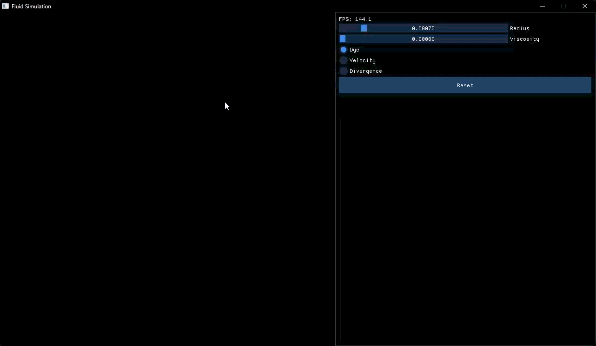

# 2D Eulerian Fluid Simulation Engine

A real-time, GPU-accelerated 2D grid-based fluid simulation built in C++ and OpenGL.



## Overview
This project implements an Eulerian fluid dynamics solver using OpenGL compute shaders for high-performance physics execution. Pressure-velocity coupling is resolved using a parallelized Red-Black Gauss-Seidel iterative solver on the GPU.

## Key Features
* **GPU Acceleration:** Core physics passes (advection, divergence, pressure solve, velocity subtraction) implemented entirely in OpenGL Compute Shaders (GLSL).
* **Pressure Solver:** Custom Red-Black Gauss-Seidel iterative solver for Poisson pressure equations.
* **Real-time Interaction:** Visualized using modern C++ and OpenGL rendering pipelines.

## Technical Analysis & Known Limitations
* **Grid Artifacting & High-Frequency Noise:** Currently observing minor grid-aligned artifacts during rapid velocity updates. Investigating the implementation of higher-order advective schemes (e.g., MacCormack or BFECC) to reduce numerical dissipation and spatial errors inherent to standard Semi-Lagrangian advection.
* **Pressure Solver Convergence:** High pressure gradients can require additional Red-Black Gauss-Seidel iterations at larger grid resolutions. Future optimizations will explore multigrid methods to accelerate convergence on the GPU.

## Future Improvements & Roadmap
- [ ] **Vorticity Confinement:** Add vorticity confinement passes to preserve fine-scale turbulent details and reduce numerical dissipation.
- [ ] **Boundary Handling:** Expand obstacle collision support to handle complex arbitrary geometries in the compute shader.
- [ ] **Performance Benchmarking:** Implement GPU timer queries to measure pass-by-pass execution time across varying grid resolutions (e.g., 512x512 vs 1024x1024).
- [ ] **3D Extension:** Port the grid structure and compute shader passes from 2D to 3D.
- [ ] **Web Port:** Port the simulation to be supported on WebGL for real-time interaction.

## Tech Stack
* **Language:** C++17
* **Graphics API:** OpenGL 4.3+ (Compute Shaders)
* **Build System:** CMake
* **Libraries:** GLFW, GLAD, GLM, Dear ImGui

## Project Architecture
1. **Advection:** Semi-Lagrangian advection of velocity and scalar density fields.
2. **Divergence:** Compute velocity field divergence across grid cells.
3. **Pressure Projection:** Iterative Red-Black Gauss-Seidel solve.
4. **Gradient Subtraction:** Update velocity field to enforce incompressibility.

## Dependencies & Third-Party Software
This project uses the following open-source libraries:
* **[GLFW](https://www.glfw.org/)** – Window creation and input handling (Zlib License)
* **[GLAD](https://github.com/Dav1dde/glad)** – OpenGL loader generator (WTFPL/Public Domain)
* **[GLM](https://github.com/g-truc/glm)** – OpenGL Mathematics library (Happy Bunny License / MIT License)
* **[Dear ImGui](https://github.com/ocornut/imgui)** – Bloat-free Graphical User interface (MIT License)

## Build Instructions
```bash
mkdir build && cd build
cmake ..
cmake --build .

